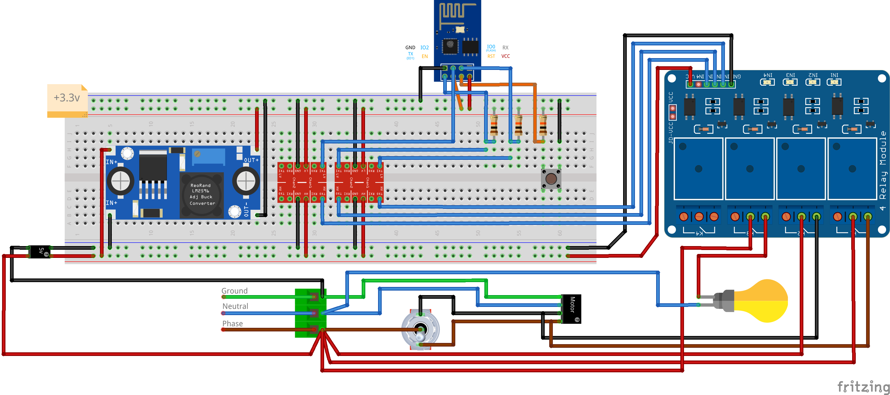

## Installation

Follow the [official installation guide](https://github.com/home-assistant/supervised-installer).

## Configuration

Config examples provided by community https://www.home-assistant.io/examples/#example-configurationyaml

### Rolonator

Disclaimer: this is a hobby projects and schematics could be simplified by using different parts. I've used what I had, and for learning purposes.

### Esphome notes

Home page https://esphome.io/

Location of configuration files within host machine:
- `/usr/share/hassio/homeassistant/esphome`
